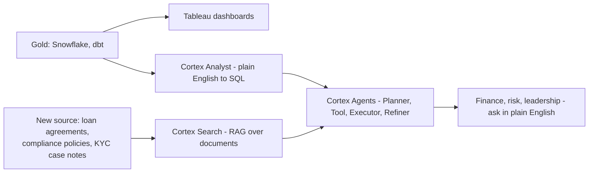

# Snowflake Cortex / GenAI — Augment Overview

**Attaches to:** `project-stories/fintech/`, specifically on top of the Gold warehouse layer (Snowflake + dbt, see `01-pipeline-overview.md`) and alongside the existing Serving layer (Tableau).

## In two sentences

The fintech platform's Gold layer already holds certified, single-source-of-truth tables for revenue, loans, and customers — but finance, risk, and leadership still have to know SQL (Structured Query Language) or wait for an analyst to get an answer. Snowflake Cortex adds a layer on top of those same Gold tables that lets people ask questions in plain English and get answers grounded in that certified data, instead of a spreadsheet or a new dashboard request.

## Why this is an augment, not part of the core story

The base fintech story (`00` through `08`) is meant to stay true regardless of which company or JD you're interviewing for — it's the universal "how I'd build this platform" narrative. Snowflake Cortex, RAG (Retrieval-Augmented Generation), and Agentic AI are specific to interviews where the JD calls them out (like this one). Keeping them in a separate, clearly-labelled folder means the core story never has to be rewritten or caveated for an interview that doesn't care about AI/ML — this augment is simply left out of the conversation.

## What's covered here (roadmap)

- `01-cortex-core-and-rag.md` — Cortex Complete, Cortex Search, Cortex Analyst, CoWork, Snowflake AI Functions, and the RAG pipeline behind them (chunking, embeddings, hybrid search, re-ranking).
- `02-agentic-ai-cortex-agents.md` — Cortex Agents and the Planner–Tool–Executor–Refiner pattern: how an agent breaks down a multi-step business question and calls SQL/APIs to answer it.
- `03-evaluation-responsible-ai.md` — LLM (Large Language Model)-as-a-Judge, faithfulness/groundedness/hallucination metrics, and Cortex Guardrails.
- `04-deployment-governance-cost.md` — CI/CD (Continuous Integration/Continuous Deployment) for AI apps, monitoring, governance, and Snowflake credit/cost optimization.

## Where it attaches — and an honest gap

Cortex Analyst is the most direct fit: it turns a plain-English question into SQL run against existing tables, so it sits directly on top of Gold with no new data needed. Cortex Search and RAG, on the other hand, are built for *unstructured* documents (PDFs, contracts, transcripts) — and the six sources in `00-problem-statement.md` are all structured systems (databases, ledgers, APIs). To use RAG honestly rather than forcing it in, this augment adds one new, realistic source: a document store of loan agreements, compliance policies, and KYC (Know Your Customer) case notes (confirm) — the kind of unstructured material a fintech genuinely accumulates alongside its transactional data.

Tableau keeps serving the fixed dashboards it already does; Cortex adds a second, conversational path onto the same Gold tables (plus the new document source) for the questions a pre-built dashboard doesn't cover.
