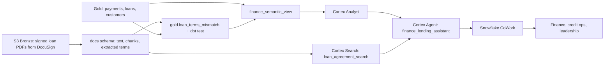

# Architecture and Ask Finance — Cortex Analyst

**Attaches to:** `project-stories/fintech/`. Cortex runs inside Snowflake, so it sits on the Snowflake side of that pipeline: on top of the Gold tables, plus one new document source (signed loan agreements) that enters through Bronze like every other source.

## In two sentences

Gold already holds one certified definition of revenue, loans, and customers, but anyone without SQL (Structured Query Language) still has to wait for an analyst to ask it a new question. Snowflake Cortex (Snowflake's built-in AI (Artificial Intelligence) features) lets people ask those questions in plain English and get answers built from the same certified data, and lets the pipeline read signed loan agreements to check them against Mambu.

## Two use cases, one agent

In plain terms: what we built, and which existing problem each piece fixes. The agent isn't a new problem. It's one assistant that uses both use cases together.

| # | Use case | Cortex pieces | Problem it fixes (`00-problem-statement.md`) |
|---|---|---|---|
| 1 | **Ask Finance** (this file) | Cortex Analyst + a semantic view over Gold | #1 three answers to "how much did we make"; #2 slow, analyst-dependent reporting |
| 2 | **Loan-agreement documents** (`02-loan-documents-ai-functions-rag.md`) | Cortex AI Functions + Cortex Search (RAG (Retrieval-Augmented Generation)) | #4 hard audits: nobody checks Mambu's typed loan terms against the signed contract |
| — | **One agent over both** (`03-cortex-agents-cowork.md`) | Cortex Agents + Snowflake CoWork | Questions needing numbers *and* contract wording |

## Where each piece sits in the pipeline

In plain terms: where each new Cortex piece lives in our existing Bronze → Silver → Gold → Serving layers.

| Layer | What Cortex adds |
|---|---|
| **Bronze** | Signed loan PDFs (Portable Document Format files) from DocuSign land untouched in `s3://company-raw/docusign/date=.../`, pulled nightly like the other scheduled sources. |
| **Silver equivalent** | A `docs` schema *inside Snowflake*: parsed text, chunks, and extracted loan terms. PDFs skip Databricks on purpose: Cortex AI Functions only run in Snowflake, so routing them through Spark would add a hop and cost while doing no work. |
| **Gold** | Unchanged certified tables, plus one new model, `gold.loan_terms_mismatch`. |
| **Serving** | `finance_semantic_view` + Cortex Analyst, the `loan_agreement_search` service, and the `finance_lending_assistant` agent, reached through Snowflake CoWork. Tableau keeps serving the fixed dashboards. |

RAG sits in Silver (chunks) and Serving (search service), never in Gold. Gold is for certified business metrics, and document chunks aren't metrics.



**Front end, briefly:** we started with a Streamlit in Snowflake app (Streamlit is a Python library for simple web apps) with one tab per use case. We're migrating to Snowflake CoWork, Snowflake's chat app for agents (named Snowflake Intelligence until 2026), because one agent there can answer questions that span both use cases. Why and how is in `03-cortex-agents-cowork.md`.

---

## Use case 1: Ask Finance

### The problem, concretely

Finance, product, and risk each used to compute "revenue" differently (`00-problem-statement.md`: a \$100 payment with a \$5 refund and a \$3 Adyen fee was "\$100 of sales" to product and "\$92 of revenue" to finance). Gold fixed the definitions. It's a star schema: fact tables hold the events we measure (`gold.fct_payments`, one row per payment), and dimension tables hold their context (`gold.dim_customer`).

Gold itself isn't limited to dashboards. Anyone who writes SQL can ask it anything. The limit was people: finance leads who don't write SQL only saw questions someone had already built a Tableau dashboard for. Any new question, such as "net revenue by product for small businesses in Texas last quarter", became a ticket to an analyst, with roughly a 2-day wait (confirm). Cortex Analyst doesn't change Gold; it writes the SQL for those people.

One catch: Gold is deterministic (the same SQL always gives the same number), but Cortex Analyst is AI, so the SQL it writes can vary. The semantic view and the accuracy test set below exist to control that.

### What Cortex Analyst is

Cortex Analyst is a managed Snowflake service that turns a plain-English question into SQL, runs the SQL on your tables, and returns the result along with the SQL it wrote. It doesn't guess from raw table names. It reads a **semantic view**: a business dictionary stored in Snowflake that says which tables exist, how they join, what each column means, and how each metric is calculated.

Think of it as a system prompt for SQL, but stricter in three ways. It holds fixed formulas, not free-text advice. It allows only the joins you declare. And it's a governed Snowflake object, with permissions, version control in Git, and a test set guarding every change.

### The semantic view we built

`finance_semantic_view` covers three Gold tables: `gold.fct_payments` (one row per transaction), `gold.fct_loan_balance_daily` (one row per loan per day), and `gold.dim_customer` (later also `gold.loan_terms_mismatch`, from `02`). The core of it:

```sql
CREATE SEMANTIC VIEW finance_semantic_view
  TABLES (payments AS gold.fct_payments PRIMARY KEY (txn_id),
          customers AS gold.dim_customer PRIMARY KEY (customer_id))
  RELATIONSHIPS (payments (customer_id) REFERENCES customers)
  DIMENSIONS (payments.product AS payments.product,
              payments.settled_month AS DATE_TRUNC('month', payments.settled_at_utc))
  METRICS (
    payments.gross_payment_volume AS SUM(payments.amount_gross) WITH SYNONYMS ('GPV', 'sales'),
    payments.net_revenue AS SUM(payments.amount_gross - payments.refund_amount - payments.processor_fee)
      WITH SYNONYMS ('revenue')
  )
  AI_VERIFIED_QUERIES (...);  -- question + SQL pairs copied from the certified dashboards
```

Each part has a job:
- **Tables** are the only tables Analyst may use. Each gets a friendly name, and its primary key tells Analyst what one row is (one payment, one customer).
- **Relationships** are the only allowed joins: each payment's `customer_id` points to one customer. That's how "net revenue by customer segment" reaches the segment column.
- **Dimensions** are the columns people can group or filter by, here product and settlement month. Without them, "by product" or "in March" has nothing to attach to.
- **Metrics** hold the agreed formulas, so `net_revenue` means \$92 in the example above for everyone.
- **Synonyms** map the words people actually type ("GPV", "sales", "revenue") to the right metric. We deliberately made "revenue" mean *net* revenue, the definition finance and leadership signed off on. That is the decision that ends the three-answers problem: a product manager asking for "revenue" now gets net revenue, with the formula shown.
- **Verified queries** are question-and-SQL pairs copied from the certified dashboards. Analyst uses them as worked examples, and they guarantee the dashboard's questions return the dashboard's numbers.

### How one question flows

1. A CFO (Chief Financial Officer) asks: "What was net revenue in March by product?"
2. Cortex Analyst reads `finance_semantic_view`, maps "net revenue" to the `net_revenue` metric, "March" to `settled_month`, and "by product" to `product`, then writes the SQL:
   ```sql
   SELECT product, SUM(amount_gross - refund_amount - processor_fee) AS net_revenue
   FROM gold.fct_payments
   WHERE DATE_TRUNC('month', settled_at_utc) = '2026-03-01'
   GROUP BY product;
   ```
3. The SQL runs on a small Snowflake warehouse (the compute that runs queries) **as the asking user's role**, so every existing permission and column mask still applies.
4. The answer comes back as a table, with the generated SQL shown. Showing the SQL matters for SOX (Sarbanes-Oxley Act) audits: any number can be traced to the exact query that produced it.
5. If a question is ambiguous ("how are we doing?"), Analyst asks a clarifying question or suggests specific questions instead of guessing.

### Decisions and trade-offs

- **Semantic view on Gold only, never Silver.**
  - **"Certified"** means finance has signed off that a table and its formula are the official number, and dbt tests guard it on every build. Gold is certified. Silver is only cleaned and matched, and still keeps each source's own view of the money.
  - The same \$100 payment is \$100 in `silver.transactions` (what the customer paid), \$97 in `silver.settlements` (after Adyen's fee), and \$92 in `silver.ledger` (NetSuite, after refund and fee).
  - Analyst on Silver could pick any of those, which would automate the three-answers problem. Gold has one table and one formula.
- **Access:** Snowflake grants Cortex Analyst to the PUBLIC role by default. We revoked that and granted `SNOWFLAKE.CORTEX_ANALYST_USER` only to the finance, risk, and leadership roles.
- **Scale:** about 150 users asking around 600 questions a week (confirm).
- **Measuring accuracy.**
  - *Why:* Analyst's SQL can vary, and adding one synonym to fix one question can quietly break another. We need to catch that before users do.
  - *The test set:* 120 real questions, each with an answer we know is right because a person wrote and checked the SQL (often the certified dashboard's own SQL). *Example:* "How many active customers do we have?" → 410,112 (confirm).
  - *On every change:* CI (Continuous Integration), our automated check, sends all 120 questions to Analyst, runs the SQL it writes, and compares the **results**, not the SQL text, since two different queries can both be correct.
  - *Ship rule:* the score (matches ÷ 120) must not drop, and no question that passed before may now fail.
  - *Result (confirm):* 109/120 (91%) at first, mostly word problems like "sales" matching no metric and the active-customers bug below. After adding synonyms, the `active_customers` metric, and verified queries: 116/120 (97%). The last 4 are genuinely ambiguous questions, like "sales by state" (billing state or business state?), where Analyst now asks instead of guessing.
- **Cost:** Analyst is billed per question answered (only successful responses), plus the warehouse time to run the generated SQL. We use an extra-small warehouse that suspends after 60 seconds idle, and track spend in the `CORTEX_ANALYST_USAGE_HISTORY` view.

### Gotcha (confirm — illustrative until matched to a real incident)

Early on, "how many active customers do we have?" returned about 1 million: every row in `gold.dim_customer`. Finance's certified definition is "customers with at least one settled transaction in the last 90 days", which was about 410,000 (confirm). Analyst wasn't wrong given what it knew; the definition simply wasn't in the semantic view. Fix: added an `active_customers` metric with the 90-day rule plus a verified query, and added that question to the test set so it can't regress.
