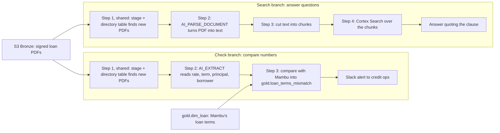

# Loan-Agreement Documents — Cortex AI Functions + RAG

**Attaches to:** `project-stories/fintech/`. It adds a seventh source that enters Bronze like the other six, is processed in a `docs` schema inside Snowflake, produces one Gold model (`gold.loan_terms_mismatch`), and is served through a Cortex Search service. Layer placement is summarised in `01-architecture-and-cortex-analyst.md`.

## The problem, concretely

Every loan's terms (interest rate, term, principal) are typed by hand twice, into two systems that never talk to each other (confirm):
1. **Mambu:** loan operations creates the loan as a pending application, typing the terms from the credit approval. Mambu assigns the loan ID (identifier), e.g. `L-778`.
2. **The agreement:** the loan officer fills in a Word template, typing the same terms again, and sends it for signature through DocuSign.

Late changes and typos reach one copy but not the other. *Example:* Jane's Bakery negotiates its rate down to 12.5% to close the deal. The officer edits and re-sends the agreement, but Mambu keeps 15%. The signed agreement is the legally binding one, so Jane is overcharged every month, which is both a legal risk and an audit problem (#4 in `00-problem-statement.md`). Before this, the only check was auditors hand-comparing a sample of 25 loans a quarter (confirm).

### Why typed by hand, and why we check rather than automate the typing

- **Why it was manual to begin with:** DocuSign and Mambu are two separately bought systems with no connection. The terms exist only as words inside a PDF (Portable Document Format file), spread across several template versions plus officers' own edits, so no simple script could reliably type them into Mambu.
- **Why we catch mismatches afterwards instead of letting AI (Artificial Intelligence) type the terms into Mambu:**
  - *Mistakes don't cost the same.* A false alarm costs a reviewer a minute; a wrong rate in Mambu silently overcharges a customer for years.
  - *Our own proof:* the APR (Annual Percentage Rate) mistake under Gotchas. Had the AI been typing terms into Mambu, about 1 in 20 new loans would have been set up at the APR, and nothing would have caught it. Because the AI was only checking, the same mistake showed up as a burst of flags and was fixed before any customer was charged (confirm).
  - *The checker is separate from the maker.* People enter the terms; the AI independently checks them. Banks call this "maker-checker", or the four-eyes principle. If the AI did both, it would be checking its own work.
  - *The data platform only reads from Mambu;* it never writes into it.
- In audit terms, this is a **detective control**: it finds errors after they happen, without adding a new way for errors to get in.

## The new source: signed PDFs from DocuSign

- **How it's pulled:** a nightly Airflow task calls the DocuSign eSignature API (Application Programming Interface), asks for agreements completed since the last run, and downloads each signed PDF. It's the same scheduled-pull pattern as the other vendor sources in `02-ingestion-debezium-kafka-scheduled-pulls.md`.
- **How each PDF is tied to its loan:** the loan ID is created in Mambu and copied *into* DocuSign, never the other way round (confirm):

| # | Who | What happens |
|---|---|---|
| 1 | Loan ops | Creates the loan in Mambu as pending; Mambu generates `L-778` |
| 2 | Loan officer | Opens a DocuSign envelope (one package sent for signature: the PDF, who signs it, and its status), copies `L-778` into a required hidden field, `mambu_loan_id`, and sends the unsigned agreement. The borrower never sees this field. |
| 3 | Borrower | Signs; DocuSign marks the envelope completed |
| 4 | Loan ops | Activates `L-778` in Mambu and pays out the money |
| 5 | Nightly pull | Downloads the signed PDF plus the hidden field and saves it as `s3://company-raw/docusign/date=.../loan_L-778_env_9f3a.pdf`. `env_9f3a` is DocuSign's envelope ID, so two agreements for one loan never overwrite each other. |

- This avoids fuzzy matching (guessing the loan from the borrower's name or the amount). Because the officer types the ID, a typo could attach a PDF to the wrong loan; the borrower-name check in check step 3 catches that.

## Two branches from one PDF

Both branches start with the same step 1, which finds new PDFs. After that they share nothing, so a failure in one never blocks the other. Each branch numbers its own steps.



| | Check branch (steps 1 → 2 → 3) | Search branch (steps 1 → 2 → 3 → 4) |
|---|---|---|
| **Purpose** | Flag loans where the contract and Mambu disagree | Let people ask what any contract says |
| **Runs** | Extracts once per new PDF; compares every loan, every night | Text, chunks, and search index refresh nightly; answers only when someone asks |
| **Covers** | Rate, term, principal, plus the borrower's name to confirm the PDF belongs to that loan | The whole agreement: prepayment, late fees, fixed vs variable, APR, … |
| **Output** | A mismatch list and a Slack alert | An answer that quotes the clause and names the PDF |

- **The search index is a knowledge base of signed loan agreements only.** That's deliberate: there are no policies or other documents in it, and only credit ops and compliance can search it, because agreements contain personal details. The search branch is the RAG (Retrieval-Augmented Generation) part.
- **Its limit:** search returns the few best-matching passages. It answers "what does *this* contract say?", but not "*how many* contracts say X?". For a count across all loans, extract that field into a table (as check step 2 does) and count it with SQL (Structured Query Language) or Cortex Analyst.

## Check branch, step by step

### 1. Point Snowflake at the PDFs (shared with the search branch)

```sql
CREATE STAGE docs.docusign_stage URL = 's3://company-raw/docusign/'
  STORAGE_INTEGRATION = s3_company_raw DIRECTORY = (ENABLE = TRUE AUTO_REFRESH = TRUE);
```

- A **stage** is a pointer to an S3 (Amazon Simple Storage Service) folder. The PDFs stay in S3; Snowflake reads them in place.
- The **directory table** is a list of the files in that folder that Snowflake keeps up to date automatically (`relative_path`, `last_modified`, and `md5`, a content fingerprint). Every model below reads only files newer than its last run, so each PDF is processed exactly once.
- If DocuSign re-delivers an agreement, it has the same `md5`, which is the model's unique key, so it's ignored. This is the same checksum idea as the Adyen manifest in `02-ingestion-debezium-kafka-scheduled-pulls.md`.

### 2. Extract the terms (`docs.loan_agreement_terms`)

```sql
AI_EXTRACT(
  file => TO_FILE('@docs.docusign_stage', relative_path),
  responseFormat => {'interest_rate_pct': 'Nominal annual interest rate in percent? Not the APR.',
                     'term_months': 'Loan term in months?',
                     'principal_usd': 'Principal amount in US dollars?',
                     'borrower_name': 'Legal name of the borrower?'},
  scores => TRUE)
```

- **What it reads:** the list of new files and their loan IDs, straight from step 1's directory table, and the **PDF itself**, not the parsed text from search step 2. Reading the file keeps layout (tables, checkboxes, handwriting) that plain text loses. The trade-off is that each PDF is read twice, here and in search step 2, which costs more; `AI_EXTRACT(text => …)` on that parsed text would be the cheaper option.
- **What it answers:** exactly the questions above, with one answer each plus a 0–1 confidence per answer (`scores => TRUE`). The result comes back as JSON (JavaScript Object Notation) and is flattened into one row per loan.
- **Why not regex (text pattern matching)?** Agreements came from three template versions over the years, with different wording ("Interest shall accrue at…", "Rate: … per annum"). Patterns kept breaking; `AI_EXTRACT` reads meaning, not exact wording.
- **Low confidence isn't a mismatch.** Any field scoring below 0.8 (confirm) is flagged `needs_review` and goes to a person. It never raises a mismatch on its own.

### 3. Gold: compare with Mambu (`gold.loan_terms_mismatch`)

- **No chunks, no search, no AI here.** It's plain SQL comparing numbers.
- **The join:** a join lines up two tables wherever they share a key. This model joins step 2's `docs.loan_agreement_terms` (what the contract says) to `gold.dim_loan` (Mambu's terms, one row per loan, arriving through the normal pipeline) on the loan ID. It then compares each pair: the rate must match to two decimals, and term and principal must match exactly.
- **Output:** one row per disagreeing field, with columns `loan_id, field, contract_value, mambu_value, status`.
- **Borrower-name check:** the extracted borrower name is compared with the Mambu loan's customer name, ignoring case and punctuation. If they differ, the PDF is probably attached to the wrong loan (an ID typo), so the loan gets a single `borrower_name` row with status `wrong_link` for review, instead of a mismatch on every field.
- **`open` → `resolved`:** credit ops corrects Mambu. On the next nightly run the values match, so the row is marked `resolved` automatically.
- **The test and the alert:** a dbt (data build tool) test checks for unresolved rows (`open` or `wrong_link`). A dbt test can only pass, warn, or fail:
  - With `severity: error`, the nightly run would stop. Gold wouldn't publish, and every finance dashboard would show yesterday's numbers.
  - We use `severity: warn`. Open mismatches are business findings (a to-do list for credit ops), not broken data, and some are always being worked on. By contrast, "transaction IDs must be unique" stays `error`, because duplicates mean revenue is wrong.
  - The test itself sends nothing. After the nightly run, an Airflow task posts the rows first seen tonight to the credit-ops Slack channel.
- **Queryable:** Cortex Analyst only knows the tables listed in `finance_semantic_view` (`01`). Adding this model there lets people ask "how many loans have open term mismatches?" in plain English, and lets the agent in `03` combine it with loan balances.
- **First full run (confirm):** 0.8% of active loans (~4,000) had a real mismatch. Examples include a typed 15% where the contract says 12.5%, and 36 months where the contract says 48. Credit ops corrects Mambu and refunds overcharged customers. For audits, we went from hand-checking 25 loans a quarter to checking every loan every night.

## Search branch, step by step

### 1. Point Snowflake at the PDFs (shared with the check branch)

The same stage and directory table as check step 1: created once and read by both branches. It hands this branch the list of new files, so each PDF is parsed exactly once.

### 2. Parse: PDF → text (`docs.loan_agreement_text`)

A dbt incremental model that reads only files newer than its last run and takes `mambu_loan_id` from the filename. The key call:

```sql
AI_PARSE_DOCUMENT(TO_FILE('@docs.docusign_stage', relative_path), {'mode': 'LAYOUT'}):content
```

`AI_PARSE_DOCUMENT` turns a PDF into text. `LAYOUT` mode keeps headings and tables (as Markdown). That matters because repayment schedules are tables, and step 3 cuts the text at the headings. The other mode, `OCR` (Optical Character Recognition, reading text off an image), is for scanned pages.

### 3. Chunk: text → search-sized pieces (`docs.loan_agreement_chunks`)

```sql
SNOWFLAKE.CORTEX.SPLIT_TEXT_RECURSIVE_CHARACTER(agreement_text, 'markdown', 1500, 200)
-- returns an array of chunks; the model flattens it to one row per chunk
```

- **Chunking** cuts each agreement into small pieces, so search can return just the relevant clause instead of a whole 12-page contract.
- **1,500 characters** (about 250–300 words) keeps each chunk under Snowflake's guidance of about 512 tokens, where search quality is best.
- **200 characters of overlap** between neighbouring chunks means a clause cut at a boundary still appears whole in at least one chunk.
- **`'markdown'`** makes the splitter cut at headings first, so a section like "7. Interest" usually stays in one chunk.

### 4. Serving: Cortex Search over the chunks

```sql
CREATE CORTEX SEARCH SERVICE docs.loan_agreement_search
  ON chunk_text ATTRIBUTES mambu_loan_id
  WAREHOUSE = cortex_wh TARGET_LAG = '1 hour'
  AS (SELECT chunk_text, mambu_loan_id, relative_path FROM docs.loan_agreement_chunks);
```

- **What a search service is:** a search engine that Snowflake builds and runs over one table. Think Google, but only for our agreement chunks. It keeps its own index and refreshes it.
- **`ON chunk_text`:** the text that gets searched.
- **`ATTRIBUTES mambu_loan_id`:** a filter column, like the filters on a shopping site: "only search L-778's agreement." Without it, a question about one loan could return another borrower's clause.
- **`WAREHOUSE = cortex_wh`:** the compute that builds and refreshes the index.
- **`TARGET_LAG = '1 hour'`:** the index may fall at most about an hour behind the table. Refreshes only process changed rows, so quiet hours cost almost nothing, and each night's new agreements are searchable soon after the load.
- **`AS (SELECT …)`:** what goes into the index: the text, the filter column, and the file path, so answers can name the PDF.
- **Embeddings (meaning):** each chunk is converted into a list of 768 numbers (with the default `snowflake-arctic-embed-m-v1.5` model), and chunks with similar meaning get similar numbers. "Fixed nominal rate of 12.50% per annum" and "what's the yearly interest?" share almost no words, but they still match. The model is English-only, which is fine because all our agreements are in English (confirm).
- **Hybrid search and reranking:** keyword search (exact terms, like a loan number or "prepayment penalty") and meaning-based search (the same idea in different words, like "early payoff fee") run together. A reranking model then reads the question alongside each candidate and reorders them by real relevance, and the top 5 are kept. Agreements use both styles of wording, so we need both kinds of search.
- **Search finds, the LLM answers:** Search only returns passages; it doesn't write answers. An LLM (Large Language Model) then answers using only those passages ("if the answer isn't in them, say so"), quoting the clause and naming the PDF. Retrieval plus generation is RAG. Answers come from the contract, not from the model's memory, which makes them usable in a dispute.

Before the CoWork migration, this was the Streamlit "Loan Review" tab, which called Search and then `AI_COMPLETE`; now the agent does it (`03`). A traced example is at the end of this file.

## Gotchas (confirm — illustrative until matched to a real incident)

- **APR versus nominal rate.**
  - **What happened:** the first extraction run flagged 6% of loans, far more than expected, and most weren't real mismatches. Agreements state both the APR (which includes fees) and the nominal interest rate. Mambu stores only the nominal rate, but the original question just asked for "the interest rate."
  - **Fix:** we reworded the question to "nominal annual interest rate … not the APR," then checked extraction against 200 hand-verified agreements before trusting it. Real mismatches dropped to 0.8%.

## Sample data: one agreement through each branch (illustrative, confirm)

**Shared input.** The signed PDF (excerpt):

```
BUSINESS LOAN AGREEMENT
Borrower: Jane's Bakery LLC

1. LOAN AMOUNT. Lender agrees to lend Borrower $50,000.00 (the "Principal").
5. REPAYMENT. 48 equal monthly installments of $1,329.00, starting March 16, 2026.
7. INTEREST. Interest shall accrue on the unpaid Principal at a fixed nominal
   rate of 12.50% per annum. The Annual Percentage Rate (APR), which includes
   the origination fee in Section 8, is 13.59%.
8. ORIGINATION FEE. A one-time fee of $1,000.00, deducted from the amount disbursed.
9. PREPAYMENT. Borrower may repay the loan in full at any time without penalty.
```

It came in DocuSign envelope `9f3a…`, completed on 16 Feb 2026, with the hidden field `mambu_loan_id = L-778`. The nightly pull saves it as `s3://company-raw/docusign/date=2026-02-17/loan_L-778_env_9f3a.pdf`.

The same loan in Mambu, as it arrives in `gold.dim_loan`:

| loan_id | customer | principal_usd | interest_rate_pct | term_months | status |
|---|---|---|---|---|---|
| L-778 | Jane's Bakery LLC | 50,000.00 | **15.00** | 48 | active |

### Example A: flagging a mismatch (check branch: steps 1 → 2 → 3)

**Step 1:** the directory table gains one row.

| relative_path | last_modified | md5 |
|---|---|---|
| date=2026-02-17/loan_L-778_env_9f3a.pdf | 2026-02-17 02:04 | 7c1e9a… |

**Step 2:** `AI_EXTRACT` answers the four questions.

| Field | Answer | Confidence |
|---|---|---|
| interest_rate_pct | 12.5 | 0.97 |
| term_months | 48 | 0.99 |
| principal_usd | 50000 | 0.99 |
| borrower_name | Jane's Bakery LLC | 0.99 |

"Not the APR" in the question made it skip the 13.59% in the same section. Every confidence is at least 0.8, so `needs_review = no`.

**Step 3:** the join lines up both sides.

| Field | Contract | Mambu | Match |
|---|---|---|---|
| interest_rate_pct | 12.50 | 15.00 | ✗ |
| term_months | 48 | 48 | ✓ |
| principal_usd | 50,000 | 50,000 | ✓ |
| borrower_name | Jane's Bakery LLC | Jane's Bakery LLC | ✓ (PDF is linked to the right loan) |

The result in `gold.loan_terms_mismatch`:

| loan_id | field | contract_value | mambu_value | status |
|---|---|---|---|---|
| L-778 | interest_rate_pct | 12.50 | 15.00 | open |

- The dbt test warns (1 unresolved row), and Gold still publishes.
- 02:40: the Airflow task posts to Slack: *"New loan-term mismatch: L-778 (Jane's Bakery LLC), interest rate: contract 12.50%, Mambu 15.00%."*
- 09:15: credit ops corrects Mambu to 12.50%. The next night the values match, so the row becomes `resolved`.
- It was caught before the first repayment on 16 March. At 15%, Jane would have paid \$1,391.54 a month instead of \$1,329.00: \$62.54 too much, or about \$3,000 over 48 months.

### Example B: answering a question (search branch: steps 1 → 2 → 3 → 4)

Credit ops calls Jane about the corrected rate, and she asks whether she can pay the loan off early.

**Step 1:** the same new directory-table row as in Example A hands this branch the file.

**Step 2:** `docs.loan_agreement_text` gains one row, with `mambu_loan_id = L-778` and `agreement_text = "# BUSINESS LOAN AGREEMENT … ## 7. INTEREST Interest shall accrue …"` (about 36,000 characters). `LAYOUT` mode turned the section titles into Markdown headings (`##`).

**Step 3:** the text is cut at those headings into about 28 chunks, each tagged with `L-778` and the file path.

| chunk_no | chunk_text (start) |
|---|---|
| 0 | "# BUSINESS LOAN AGREEMENT Borrower: Jane's Bakery LLC … ## 1. LOAN AMOUNT …" |
| 6 | "## 7. INTEREST Interest shall accrue … at a fixed nominal rate of 12.50% per annum…" |
| 8 | "## 9. PREPAYMENT Borrower may repay the loan in full at any time without penalty…" |

**Step 4:**
1. The index picks up the 28 new chunks within the hour, so they're searchable by about 03:15.
2. The reviewer asks: *"Is L-778's interest rate fixed, and can the borrower repay early without a penalty?"*
3. **Filter:** only chunks where `mambu_loan_id = 'L-778'` are considered.
4. **Retrieve:** keyword search matches "fixed", "repay", and "penalty". Meaning-based search scores chunks 6 and 8 highest. Reranking keeps the top 5, with chunks 6 and 8 first.
5. **Generate:** the LLM answers only from those 5 chunks: *"Yes to both. Section 7 sets a fixed nominal rate of 12.50% per annum, and Section 9 allows repayment in full at any time without penalty. Source: loan_L-778_env_9f3a.pdf."*

Neither answer is one of the numbers the check branch compares. That's the knowledge base covering the whole agreement.
