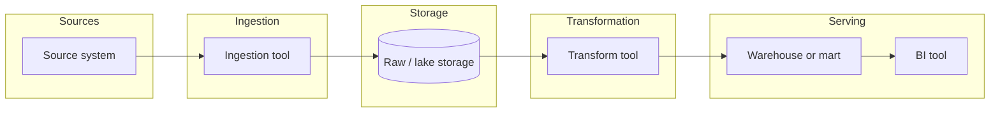

# Pipeline Overview

One diagram showing the whole pipeline, start to end, so a reader gets the overall shape before any layer file goes into detail. Keep it to main building blocks only — depth belongs in the numbered layer files that follow.

One or two sentences under the diagram, plain language, naming what each block is in this project.
