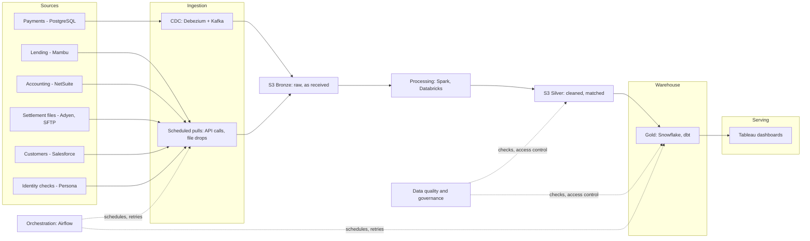

# Pipeline Overview

The whole pipeline, start to end, in one diagram. Each box is a main building block — the layer files that follow go into the detail behind each one.

## What each block is

- **Sources** — the six systems the company already runs, unchanged. See `00-problem-statement.md` for what each one holds.
- **Ingestion** — how data leaves each source. Payments moves the instant it changes, using CDC (Change Data Capture: watching the database's own log for changes, rather than repeatedly asking it for updates). Everything else is pulled on a schedule, by API call or file drop.
- **Storage (S3, Medallion layout)** — a data lake holding the data as plain files, organized in stages: Bronze is the raw data exactly as it arrived, kept untouched so anything can be replayed or fixed later; Silver is the cleaned, matched version (same customer across systems, consistent status, one time zone).
- **Processing** — the Spark/Databricks jobs that turn Bronze into Silver: matching customer IDs across systems, converting time zones, removing duplicates.
- **Warehouse (Gold, Snowflake + dbt)** — the business-ready tables: the agreed, single definition of revenue, active customers, loan exposure, and so on, built with dbt.
- **Serving** — Tableau dashboards that finance, risk, and leadership actually read.
- **Orchestration (Airflow)** — runs every scheduled step in the right order, retries failures, and alerts when something breaks. It doesn't hold data itself, which is why it sits off to the side.
- **Data quality & governance** — checks that stop bad data before it reaches Gold, plus who is allowed to see what. Also off to the side, because it applies across the pipeline rather than being one step in it.
