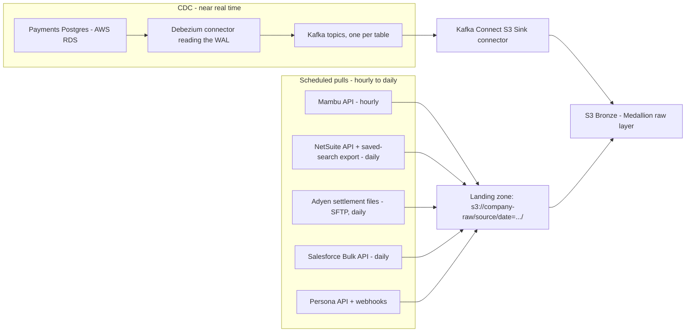

# Ingestion — Debezium + Kafka (CDC) and Scheduled API/SFTP Pulls

Two ingestion mechanisms feed Bronze, matched to what each source can offer (see `00-problem-statement.md` for what each source holds and `01-pipeline-overview.md` for where this layer sits):

1. **CDC (Change Data Capture)** — for the one source we own and run ourselves (Payments, PostgreSQL). We can read its internal change log directly, so we get every change within seconds.
2. **Scheduled pulls** — for the five vendor/SaaS systems (Mambu, NetSuite, Adyen, Salesforce, Persona). We don't own these systems and have no access to their internal logs, so a REST API (Application Programming Interface) call or an SFTP (Secure File Transfer Protocol) file drop, run on a schedule, is the only option.

## 1. CDC — Debezium + Kafka (Payments, PostgreSQL)

- **Why this tech:** Payments is our own database, under heavy continuous write load (~5 million transactions a day (confirm)). Polling it on a schedule would mean repeatedly running heavy `SELECT` queries against a live OLTP (Online Transaction Processing) system just to find what changed, which risks slowing down the app customers use to pay. Debezium reads PostgreSQL's WAL (Write-Ahead Log — the database's own internal record of every change, which it already keeps for crash recovery) instead of querying the tables, so it adds almost no load to the primary. It also catches deletes and every intermediate state, which a "give me rows changed since last time" query would miss for rows that were later deleted. See `tech-stack/data-engineering-glossary.md` for the general definitions of CDC, Kafka, and Debezium.
- **What it does in this pipeline:** Debezium's PostgreSQL connector tails the WAL and turns every insert, update, and delete on the `transactions`, `refunds`, and `chargebacks` tables into a JSON/Avro event. Each table's events go to its own Kafka topic (`payments.transactions`, `payments.refunds`, `payments.chargebacks`). A Kafka Connect S3 Sink connector reads those topics and writes the events out as Parquet files directly into S3 Bronze, partitioned by table and date.
  - One row-level change = one event, generated as it happens — nothing is batched here. An `UPDATE` touching 5 columns on one row is still one event; an `UPDATE` touching 200 rows is 200 events, one per row. The only bulk step is the one-time initial snapshot below.
- **Volume/scale:** ~5 million transactions a day, roughly 58 events/second on average, with peaks of 300–500 events/second (confirm) around paydays and promotions. Kafka topics are set to 7 days of retention (confirm) so a downstream consumer can replay recent history if something needs reprocessing. Topics are split into 12 partitions (confirm), keyed by account ID.
- **Key design decisions:**
  - **One topic per source table**, not one shared topic — each table's schema evolves independently, and downstream consumers (for example, the fraud team) can subscribe only to the table they need instead of filtering a firehose. (This is a separate stream per table, not to be confused with the partitioning below, which splits *one* topic into parallel lanes.)
  - **Partition key = account ID, not transaction ID** — every event for one account lands in the same partition, in order. This matters because a customer's balance calculation downstream depends on seeing that account's events in the order they happened; if events were spread across partitions by transaction ID, two consumers could process them out of order.
  - **Confluent Schema Registry with Avro**, set to backward-compatible evolution — Avro messages are just binary bytes with no field names in them, so something has to hold "what does byte range X mean." Instead of repeating that description in every one of the ~5 million daily messages, the schema is stored once in the registry, and each message just carries a small ID pointing to it. This also gives a place to reject an unsafe schema change before it ever reaches Kafka: when the payments team adds a new column, the registry lets it through and old consumers keep working unchanged instead of breaking on an unexpected field.
  - **Initial snapshot before streaming** — when the connector is first set up (or rebuilt), Debezium takes one consistent snapshot of the full existing table (5M+ historical rows) before switching over to live WAL streaming, so Bronze isn't missing all the history that existed before the connector started.
  - **At-least-once delivery, deduplicated downstream** — Debezium/Kafka Connect guarantee at-least-once delivery, not exactly-once, so the same event can land in Bronze twice after a connector restart. Rather than solving this inside the streaming path, we dedupe by `(table, primary key, WAL LSN)` during the Bronze → Silver merge in `03-processing-spark.md` — simpler than building exactly-once semantics into the ingestion layer itself.
- **Gotchas / what broke (confirm — illustrative until matched to a real incident):**
  - A Schema Registry outage stopped Debezium itself from producing new events to Kafka (it needs the registry to serialize each event, not just the S3 Sink connector reading them back out). With Debezium stuck, it couldn't confirm to Postgres "I'm done with this part of the log," so Postgres had to keep holding onto WAL it would normally discard — and since production kept taking payments the whole time, that unconsumed WAL kept growing and disk usage climbed toward the limit. Two things came out of this:
    - **Alerting:** a monitor checks Postgres's own replication-slot-lag number (how many bytes of WAL are still unconsumed) every minute and pages on-call once it crosses a set size, well before disk actually runs out.
    - **Runbook:** on-call's first move is always to fix the real blocker (get the registry back up) and let Debezium catch up naturally — nothing is lost that way. Only if disk is about to fill before that can happen does the runbook allow the last-resort step: delete the replication slot (this frees the disk immediately, since Postgres can now discard the backlog) and rebuild by creating a new slot plus a fresh Debezium snapshot. The cost: today's current data is fully recovered by the snapshot, but the exact blow-by-blow of what changed during the outage window is gone for good.
  - A payments engineer once renamed a column directly in production without telling the data team. To the Schema Registry, a rename looks identical to "delete the old column, add a new one" — both individually allowed under backward-compatible rules — so nothing was rejected. New events correctly started filling the new column right away; the problem was the *old* column silently stopped getting new values, and nothing merged the two into one continuous field. Any dashboard or model still reading the old column kept running with no error, just quietly went stale — that's why it took a while to notice. Fix: migrations touching any CDC-tracked table (`transactions`, `refunds`, `chargebacks`) now require a data engineer's sign-off before they can merge, the same way a pull request can require a specific team's approval — so a rename gets caught before it ships, not after.

## 2. Scheduled pulls — Mambu, NetSuite, Adyen, Salesforce, Persona

- **Why this tech:** these five systems are vendor-run SaaS (Software as a Service) products — we have an API or a file drop, never database access. A scheduled pull, orchestrated by Airflow (see `04-orchestration-airflow.md`), is the standard way to bring vendor data in at whatever cadence its API limits and our freshness needs allow.
- **What it does in this pipeline:** one Airflow task per source calls the vendor's API (or lists/downloads new files over SFTP), and lands the raw response untouched in an S3 landing prefix, one dated, run-stamped folder per pull, before it's copied into Bronze unchanged.
- **Volume/scale and pull mechanics:**

| Source | Pull mechanism | Frequency | Volume | Pagination / rate limit |
|---|---|---|---|---|
| Mambu | REST API, incremental by `lastModifiedDate` | Hourly | ~500,000 active loans; ~20,000 changed records/hour (confirm) | Cursor pagination, 100 records/page; ~10 requests/sec rate limit (confirm) |
| NetSuite | SuiteQL API + scheduled saved-search export | Daily | ~2,000,000 ledger lines/month, ~65,000/day (confirm) | Saved search capped at 1,000 rows per export; pipeline pages through results |
| Adyen | SFTP file drop | Daily, files typically land 2–4 a.m. UTC (confirm) | ~50 CSV files/day | Pipeline lists the SFTP directory and downloads only files not already in its manifest |
| Salesforce | Bulk API (REST) | Daily | ~1,000,000 customer records | Bulk API batches of 10,000 records to stay under Salesforce's governor limits |
| Persona | REST API + webhooks | Webhook on completion; daily API reconciliation pull | ~10,000 checks/day | Webhooks are push-based (no polling); daily pull re-fetches the last 48 hours (confirm) to catch anything a missed webhook dropped |

  *Example:* the Mambu task runs at the top of every hour, asks the API for every loan record with `lastModifiedDate` after the last successful run, pages through the results 100 at a time, and writes the raw JSON to `s3://company-raw/mambu/date=2026-09-28/hour=14/`.

- **Key design decisions:**
  - **Incremental pulls, not full extracts** — Mambu, NetSuite, and Salesforce pulls filter by a last-modified timestamp (or Salesforce's `SystemModstamp`) so each run only pulls what changed. This isn't just an efficiency choice: NetSuite's saved-search export can't finish a full 2-million-row dump inside its execution time limit (confirm), so incremental pulls are the only way it completes reliably.
  - **Idempotent landing** — every pull writes to a uniquely named, date/run-stamped object and never overwrites a previous one, so re-running a failed task doesn't lose or silently duplicate a load. Deduplication happens at the Bronze → Silver merge step, not in ingestion.
  - **SFTP manifest table** — Adyen doesn't guarantee a filename won't be redelivered, so ingestion keeps a manifest of filenames and checksums already processed, and skips anything it's already ingested.
  - **Webhook plus reconciliation for Persona** — relying on webhooks alone risks silently missing a check if our endpoint is briefly unreachable (a deploy, a network blip). The daily reconciliation pull re-fetches recent checks from the API and fills any gap the webhook stream missed.
  - **Secrets never hard-coded** — every API key and SFTP credential lives in a secrets manager (AWS Secrets Manager (confirm)), referenced by the Airflow connection, not stored in DAG code or config files checked into the repo.
  - **Backoff on rate limits** — every API pull retries on HTTP 429/5xx with exponential backoff, so a throttled Mambu or Salesforce API slows the pull down instead of the task failing outright.
- **Gotchas / what broke (confirm — illustrative until matched to a real incident):**
  - The NetSuite saved-search export was silently capped at 1,000 rows on a quarter-end day when journal volume spiked well past normal. Because the pull had no check comparing rows-received against a rough expected count, the gap wasn't caught until finance's reconciliation found ledger lines missing three days later. We added a "did today's row count fall within an expected range" sanity check to every scheduled pull as a result.
  - The Persona webhook endpoint was unreachable for about 40 minutes during a deploy (confirm). Without the daily reconciliation pull, those KYC (Know Your Customer) results would have been permanently lost rather than just delayed a day.
  - Adyen once redelivered the previous day's settlement file with a corrected total but the same filename pattern. Before the checksum manifest existed, this caused that day's settlement amount to be double-counted in Bronze until someone reconciled against the bank statement.

## Compliance and security in ingestion

- **PCI-DSS (Payment Card Industry Data Security Standard):** the Payments CDC stream and Adyen's settlement files only ever carry masked or tokenized card data (last 4 digits, processor tokens) — never a raw PAN (Primary Account Number). Ingestion never writes an unmasked card number anywhere, including the landing zone.
- **KYC/AML (Anti-Money Laundering):** Persona's payloads include identity-document data and sanctions-check results. The landing prefix and Bronze location for this source use a narrower IAM (Identity and Access Management) role than the rest of Bronze (confirm exact role name), so only the small set of people who need KYC data for compliance work can read it.
- **SOX (Sarbanes-Oxley Act):** the NetSuite ledger pull is a SOX-relevant control. Every run logs its source, row count, start/end timestamp, and run ID, so an auditor can trace any ledger line all the way back to the exact ingestion run that brought it in.
