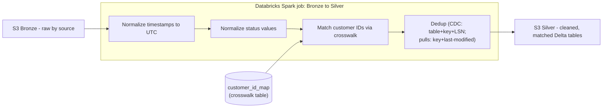

# Processing — Spark on Databricks

- **Why this tech:** Turning Bronze into Silver means joining and cleaning data at real scale (~5 million CDC (Change Data Capture) events a day from Payments, plus the daily vendor volumes from `02-ingestion-debezium-kafka-scheduled-pulls.md`) and doing it in a way that can safely re-run, correct mistakes, and update rows as corrections arrive — not just append forever. Apache Spark distributes that work across a cluster of machines instead of one. Databricks runs and manages that cluster, and adds Delta Lake, a storage layer that makes Bronze/Silver files behave like real database tables: safe concurrent writes, and `MERGE INTO` (an upsert: update a row if it exists, insert it if it doesn't) instead of only ever being able to append. Delta does this with a `_delta_log/` folder beside the Parquet files that records which files make up the table at each version. A write only becomes visible once its log entry is committed, so readers never see a half-finished write. If two jobs commit at the same moment, Delta detects the clash and one retries. That upsert ability matters here specifically because the same transaction, loan, or ledger line can arrive more than once (a CDC retry, a corrected vendor file) and Silver needs to end up with one correct row, not several. *Example:* `T-1001` lands as `pending` at 14:00 and is inserted; a CDC event at 14:20 says `settled`, so `MERGE` updates that same row — Silver holds one `T-1001` row marked `settled`, not two.
- **Where it runs (confirm):** a Databricks workspace on AWS (Amazon Web Services), in the same region as our S3 buckets (`us-east-1`), so data isn't copied across regions. Databricks hosts the web interface, notebooks, and job scheduler; the machines that actually process data run inside our own AWS account, so the data never leaves it (relevant to the card-data rules below). Spark comes pre-installed on those machines — we never install or run it separately. Each job gets its own temporary job cluster: 1 driver (the machine that plans the work) plus 2–8 workers that scale with load. The cluster shuts down when the job finishes, so we only pay while it runs.
- **What it does in this pipeline:** a Databricks job reads new Bronze data for one source/table, applies the transformations below, and writes the result into a Silver Delta table for that business entity (`silver.transactions`, `silver.customers`, `silver.loans`, and so on). Cadence matches how fast each source lands: the Payments job runs as a short, frequent batch — every 15 minutes (confirm) — since Bronze there is filling continuously from the CDC stream; the five vendor sources each trigger their own Silver job once their scheduled pull finishes landing in Bronze (hourly for Mambu, daily for the rest), orchestrated by Airflow (see `04-orchestration-airflow.md`).

- **Key transformations/logic:**
  - **Identity resolution (customer ID matching)** — the same customer has a different ID in every system (`00-problem-statement.md`'s example: Salesforce's `CUST-4821` is the same business as Mambu's loan customer `12345`, with nothing linking them automatically). Processing maintains a crosswalk table, `customer_id_map`, with one row per source ID, all pointing to one canonical ID — e.g. `salesforce: CUST-4821`, `mambu: 12345`, and `payments: acct_77812` all map to `C-000981`, and every Silver table uses `C-000981`.
    - *New customers:* when a customer applies for a loan, the application flow writes the new Mambu ID into a field on their Salesforce record (`Mambu_Customer_ID__c` (confirm)), so processing just reads the link — no guessing.
    - *Older customers (signed up before that field existed):* a one-time backfill compared Salesforce and Mambu records and scored each possible pair on email plus legal business name. Same email and near-identical name ("Jane's Bakery LLC" vs "Janes Bakery, LLC") scored ~0.97 and was linked automatically; anything under 0.9 (confirm) — e.g. same email, different business name — went to a manual review queue, a list an operations person works through, deciding "same business" or not. A wrong link would mix two businesses' money together, so uncertain pairs go to a human instead of being guessed.
  - **Time zone normalization** — every timestamp is converted to UTC (Coordinated Universal Time) in Silver. *Example:* the payments database already logs in UTC (`14:02 UTC`); NetSuite's `9:02 AM Eastern` for the same real-world moment is converted to `14:02 UTC` too, so the two can finally be compared or joined directly instead of looking like different events.
  - **Status normalization** — each source has its own words for the same real state (payments calls something "pending," Adyen's file calls the same thing "in process"). A per-source status-mapping table translates every source's vocabulary into one shared set of values (`pending`, `settled`, `failed`, `disputed`), so downstream logic only ever has to handle one vocabulary.
  - **Deduplication — two different cases, not one.** In both, Bronze keeps every copy (it's never edited) and Silver ends up with one row per real-world record; the difference is why duplicates appear and how "same record" is recognised:
    - *CDC dedup:* after a connector restart, Debezium can re-send events it already sent (`02-ingestion-debezium-kafka-scheduled-pulls.md`). Same `(table, primary key, LSN)` — LSN (Log Sequence Number) being the WAL (Write-Ahead Log) position that uniquely orders each change — means the exact same event seen twice, so the repeat is dropped. Different LSNs for the same key are real successive changes, not duplicates: `T-1001 pending` (LSN 500) then `T-1001 settled` (LSN 640). Silver keeps the highest LSN via Delta `MERGE INTO`, while the full change history stays in Bronze.
    - *Scheduled-pull dedup:* ingestion lands each run under its own name but doesn't dedupe (`02-ingestion-debezium-kafka-scheduled-pulls.md`'s idempotent-landing design defers this here). *Example:* Persona check `abc123` arrives by webhook at 14:05 and again in that night's 48-hour reconciliation pull, so Bronze holds two copies. Silver upserts by `(source primary key, last-modified timestamp)`: same last-modified means identical, so keep one; a later last-modified means a newer version, so keep that one.
- **Performance considerations:** any step that matches or groups rows by a key needs all rows with the same key on the same worker. Spark gets them there in one of two ways, chosen per step — this job uses both, but never on the same step:
    - *Broadcast — used for the customer-ID join.* `customer_id_map` (~1 million short rows, tens of MB (confirm)) is copied in full to every worker, so each worker matches its own chunk of transactions locally and the transactions never move. It's above Spark's 10 MB automatic-broadcast limit, so the code explicitly marks it for broadcast. This matters most in backfills (reprocessing a month ≈ 150 million transactions); a normal 15-minute run only has ~52,000 new transactions (5 million ÷ 96 runs a day).
    - *Shuffle — used for the dedup step.* To keep only the latest `T-1001`, every copy of `T-1001` must be on the same worker. Each worker computes a hash of the key (a number derived from `txn_id`, always the same for the same ID) to decide which worker owns it, sends each row to that worker over the network, and receives the rows for the keys it owns. Network movement is the slow part — that's why the large join avoids it — but for a ~52,000-row batch it's cheap.
    - *Incremental reads:* Bronze is stored in date folders (`s3://company-raw/payments/transactions/date=2026-10-02/`). Each job keeps a bookmark of the last file it processed and reads only newer ones, instead of rescanning months of data. ("Partition" here means one of these date folders — not the same thing as a Kafka partition in the ingestion file.)
- **Gotchas / what broke (confirm — illustrative until matched to a real incident):**
  - The payments team added a column, `payment_method_type` (`card`, `ach` — ACH (Automated Clearing House) bank transfer — or `wallet`), to the Postgres `transactions` table. As an addition it passed the Schema Registry and started appearing in Bronze. The Silver job then tried to `MERGE` rows containing that column into `silver.transactions`, which didn't have it, and Delta's schema enforcement (its default rule: reject any write containing a column the table doesn't know) rejected every write. Payments Silver stopped updating for ~4 hours (confirm) until someone added the column by hand. The alternative — coding the job to read only the columns it already knew — would have avoided the crash but silently thrown the new data away.
    - *Fix:* turned on Delta schema evolution for these merges (`spark.databricks.delta.schema.autoMerge.enabled`, or `MERGE WITH SCHEMA EVOLUTION` on newer Databricks versions — the `MERGE` counterpart of the `mergeSchema` option used for plain appends). A new column is now added to the table automatically instead of the write being rejected; old rows get null for it, and type changes (e.g. text → number) are still rejected. After each run, the job compares the table's column list with the previous run's and posts an alert naming any new column, so a human confirms it's intended. This would also have caught the column rename in `02-ingestion-debezium-kafka-scheduled-pulls.md` much sooner, since a rename shows up here as a brand-new column.

## Compliance and security in processing

- **PCI-DSS (Payment Card Industry Data Security Standard):** card data stays tokenized all the way through processing — Spark never receives, decodes, or re-stores a raw PAN (Primary Account Number); only the already-masked/tokenized form from ingestion is read or written.
- **KYC/AML (Know Your Customer / Anti-Money Laundering):** AML monitoring (spotting suspicious transaction patterns) has to connect what money moved with who the verified customer is, so Silver joins transactions with Persona-sourced customer data — a join combines rows from two tables wherever a shared key (here `customer_id`) matches. That same join is how sensitive identity data spreads by accident. *Example:* an analyst builds a "revenue by customer" table with `SELECT *` over `silver.transactions` joined to `silver.customers`, and `id_document_number` lands in a table that finance and product can all read. To prevent this, the Persona-sourced columns in `silver.customers` (`id_document_number`, `sanctions_match`, `sanctions_list_details` (confirm)) carry a column mask in Unity Catalog, Databricks' permissions system. Anyone without the KYC-compliance role from `02-ingestion-debezium-kafka-scheduled-pulls.md` sees `***MASKED***`, and the mask applies inside joins too, so the analyst's table only ever gets masked values. `kyc_status` (just passed or failed) stays visible to everyone, since operations needs it day to day (confirm).
